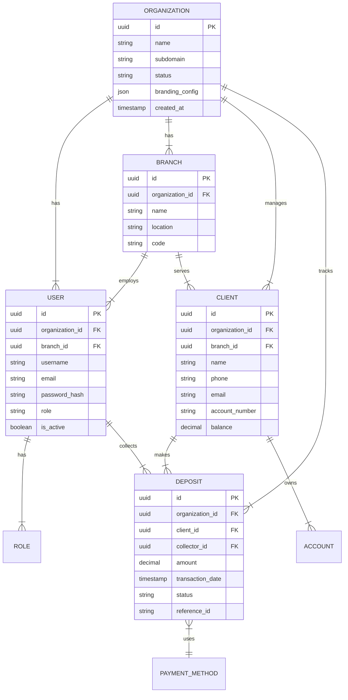

# Entity Relationship Diagram (ERD)

## Key Entities

1.  **Organization**: The tenant (Bank, MFI).
2.  **User**: System users (Admins, Managers, Collectors).
3.  **Client**: The end-customer depositing money.
4.  **Deposit**: The core transaction record.
5.  **Branch**: Physical or logical division of an organization.
